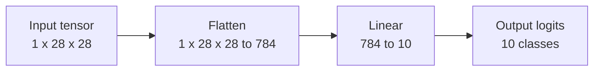
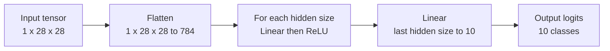
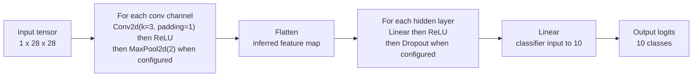
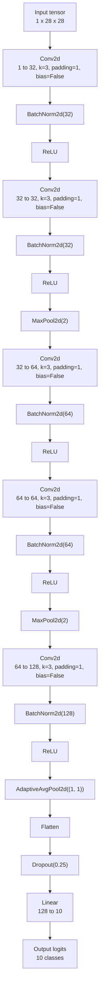

# Experiments

This document describes the numbered experiment scripts in `model/experiments` and the model configurations they train. The experiments use PyTorch models for classifying handwritten digits `0` through `9`.

## Common Setup

All numbered training experiments use the same base data source and evaluation pattern unless stated otherwise.

| Setting | Value |
| --- | --- |
| Dataset path | `.temp/dataset/HWD-V1/HWD-V1-Standard/{digit}/*.png` |
| Digit labels | Directory names `0` through `9` |
| Random seed | `RNG = 99` |
| Input resolution | `RESOLUTION = 28` |
| Input tensor shape | `(1, 28, 28)` |
| Pixel preprocessing | Open as grayscale, invert colors, resize to `28x28`, normalize to `float32` in `[0, 1]` |
| Loss | `torch.nn.CrossEntropyLoss` |
| Prediction | `argmax` over 10 output logits |
| Default batch size | `1024` |
| Device | Current PyTorch accelerator when available, otherwise CPU |
| TensorBoard logs | `.torch/runs/<experiment-name>` |
| Experiment artifacts | `.torch/experiments/<experiment-name>` |

The dataset split is deterministic per digit. `new_dataset_items(random_state=RNG)` first keeps 80% of each digit class for train/validation and 20% for test, then keeps 80% of that train/validation subset for training and 20% for validation. The resulting effective split is 64% train, 16% validation, and 20% test for each digit class.

The training scripts record per-epoch `train_loss`, `train_accuracy`, `val_loss`, and `val_accuracy`. Test evaluation uses the held-out test split and writes `loss` and `accuracy` into `results.json`.

## Experiment Index

| Script | Experiment name | Purpose |
| --- | --- | --- |
| `model/experiments/00.py` | Dataset details | Print dataset split sizes. |
| `model/experiments/01.py` | `01_simple_logistic_regression` | Train a single linear baseline. |
| `model/experiments/02.py` | `02_logistic_regression_lr` | Sweep learning rates for the linear baseline. |
| `model/experiments/03.py` | `03_layers_relu` | Compare fully connected ReLU hidden-layer layouts. |
| `model/experiments/04.py` | `04_logistic_regression_optimizers` | Compare optimizers for the linear baseline. |
| `model/experiments/05.py` | `05_convolution_configs_adamw` | Compare convolutional architectures. |
| `model/experiments/10.py` | `10_final_model` | Train the final augmented CNN. |

## 00: Dataset Details

`model/experiments/00.py` is a dataset sanity-check script, not a model-training run.

It creates the deterministic `DatasetItems` split with `new_dataset_items(random_state=RNG)` and prints the number of samples in these lists:

| Printed field | Meaning |
| --- | --- |
| `dataset_items.all_list` | All available samples across all digit classes. |
| `dataset_items.train_validate_list` | The 80% split used before separating train and validation. |
| `dataset_items.train_list` | Final training split. |
| `dataset_items.validate_list` | Final validation split. |
| `dataset_items.test_list` | Held-out test split. |

No model is constructed, no optimizer is used, and no `.pt` or `results.json` artifact is written.

## 01: Simple Logistic Regression

`model/experiments/01.py` trains the simplest baseline classifier.

| Setting | Value |
| --- | --- |
| Experiment name | `01_simple_logistic_regression` |
| Model class | `LogisticRegressionModel` |
| Architecture | `Flatten()` then `Linear(28 * 28, 10)` |
| Hidden layers | None |
| Activation functions | None |
| Optimizer | `torch.optim.SGD` |
| Learning rate | `1e-3` |
| Epochs | `50` |
| Batch size | `1024` |
| Train dataset | `DigitDataset` on `train_list` |
| Validation dataset | `DigitDataset` on `validate_list` |
| Test dataset | `DigitDataset` on `test_list` |
| Train loader shuffle | `True` |
| Validation loader shuffle | `True` |
| Test loader shuffle | `False` |

The model maps the flattened `784` input pixels directly to 10 logits. This makes it a linear classifier over pixels and establishes a baseline before testing deeper or convolutional models.

Artifacts written:

| Artifact | Description |
| --- | --- |
| `.torch/experiments/01_simple_logistic_regression/model_epoch50.pt` | Final model weights after 50 epochs. |
| `.torch/experiments/01_simple_logistic_regression/results.json` | Training history and held-out test metrics. |

ONNX export support is implemented in `model/tools/experiments/01_exporter.py`. It recreates `LogisticRegressionModel(r=RESOLUTION)` and loads the saved `.pt` state dict.

## 02: Logistic Regression Learning-Rate Sweep

`model/experiments/02.py` keeps the same linear model as experiment 01 and varies the SGD learning rate.

| Setting | Value |
| --- | --- |
| Experiment name | `02_logistic_regression_lr` |
| Model class | `LogisticRegressionModel` |
| Architecture | `Flatten()` then `Linear(28 * 28, 10)` |
| Optimizer | `torch.optim.SGD` |
| Epochs per run | `50` |
| Batch size | `1024` |
| Train dataset | `DigitDataset` on `train_list` |
| Validation dataset | `DigitDataset` on `validate_list` |
| Test dataset | `DigitDataset` on `test_list` |

Each learning rate gets a fresh model instance, so runs do not continue from previous learning rates.

| Run key | Learning rate |
| --- | --- |
| `1e-05` | `0.00001` |
| `1e-04` | `0.0001` |
| `1e-03` | `0.001` |
| `1e-02` | `0.01` |
| `1e-01` | `0.1` |
| `1e+00` | `1.0` |
| `1e+01` | `10.0` |

This experiment measures how sensitive the linear baseline is to the SGD step size. Very small rates are expected to learn slowly, while very large rates can become unstable.

Artifacts written:

| Artifact | Description |
| --- | --- |
| `.torch/experiments/02_logistic_regression_lr/model_epoch50-lr_<run-key>.pt` | Final weights for each learning-rate run. |
| `.torch/experiments/02_logistic_regression_lr/results.json` | Results keyed by learning-rate run key. |
| `.torch/runs/02_logistic_regression_lr/lr_<run-key>` | TensorBoard logs for each run. |

ONNX export support is implemented in `model/tools/experiments/02_exporter.py`. All exported models use the same `LogisticRegressionModel(r=RESOLUTION)` architecture.

## 03: Fully Connected ReLU Layer Sweep

`model/experiments/03.py` compares multilayer perceptrons with different hidden-layer sizes.

| Setting | Value |
| --- | --- |
| Experiment name | `03_layers_relu` |
| Model class | `LayeredModel` |
| Base architecture | `Flatten()`, repeated `Linear` plus `ReLU` hidden blocks, final `Linear(..., 10)` |
| Optimizer | `torch.optim.SGD` |
| Learning rate | `1e-2` |
| Epochs per run | `50` |
| Batch size | `1024` |
| Train dataset | `DigitDataset` on `train_list` |
| Validation dataset | `DigitDataset` on `validate_list` |
| Test dataset | `DigitDataset` on `test_list` |

The output layer does not use a `ReLU`; it returns raw logits for `CrossEntropyLoss`.

| Config name | Hidden sizes | Architecture summary |
| --- | --- | --- |
| `l128` | `[128]` | `784 -> 128 -> 10` |
| `l6` | `[6]` | `784 -> 6 -> 10` |
| `l6_6` | `[6, 6]` | `784 -> 6 -> 6 -> 10` |
| `l6_6_6` | `[6, 6, 6]` | `784 -> 6 -> 6 -> 6 -> 10` |
| `l6_6_6_6` | `[6, 6, 6, 6]` | `784 -> 6 -> 6 -> 6 -> 6 -> 10` |
| `l6_6_6_6_6` | `[6, 6, 6, 6, 6]` | `784 -> 6 -> 6 -> 6 -> 6 -> 6 -> 10` |
| `l8_6_3_6` | `[8, 6, 3, 6]` | `784 -> 8 -> 6 -> 3 -> 6 -> 10` |

This experiment checks whether small nonlinear hidden layers improve over the purely linear baseline, and whether narrow/deeper networks remain trainable with SGD.

Artifacts written:

| Artifact | Description |
| --- | --- |
| `.torch/experiments/03_layers_relu/model_epoch50-<config-name>.pt` | Final weights for each hidden-layer configuration. |
| `.torch/experiments/03_layers_relu/results.json` | Results keyed by hidden-layer config name. |
| `.torch/runs/03_layers_relu/<config-name>` | TensorBoard logs for each config. |

ONNX export support is implemented in `model/tools/experiments/03_exporter.py`. The exporter parses the hidden sizes from filenames such as `model_epoch50-l6_6.pt`.

## 04: Logistic Regression Optimizer Sweep

`model/experiments/04.py` keeps the simple linear classifier and compares optimizers at a fixed learning rate.

| Setting | Value |
| --- | --- |
| Experiment name | `04_logistic_regression_optimizers` |
| Model class | `LogisticRegressionModel` |
| Architecture | `Flatten()` then `Linear(28 * 28, 10)` |
| Learning rate | `1e-3` |
| Epochs per run | `50` |
| Batch size | `1024` |
| Train dataset | `DigitDataset` on `train_list` |
| Validation dataset | `DigitDataset` on `validate_list` |
| Test dataset | `DigitDataset` on `test_list` |

Each optimizer gets a fresh model instance.

| Optimizer key | PyTorch optimizer configuration |
| --- | --- |
| `sgd` | `torch.optim.SGD(parameters, lr=1e-3)` |
| `sgd_momentum` | `torch.optim.SGD(parameters, lr=1e-3, momentum=0.9)` |
| `adam` | `torch.optim.Adam(parameters, lr=1e-3)` |
| `adamw` | `torch.optim.AdamW(parameters, lr=1e-3)` |
| `rmsprop` | `torch.optim.RMSprop(parameters, lr=1e-3)` |

This experiment isolates optimizer behavior while keeping model capacity and learning rate constant.

Artifacts written:

| Artifact | Description |
| --- | --- |
| `.torch/experiments/04_logistic_regression_optimizers/model_epoch50-optimizer_<optimizer-key>-lr_1e-03.pt` | Final weights for each optimizer run. |
| `.torch/experiments/04_logistic_regression_optimizers/results.json` | Results keyed by optimizer name. |
| `.torch/runs/04_logistic_regression_optimizers/<optimizer-key>` | TensorBoard logs for each optimizer. |

ONNX export support is implemented in `model/tools/experiments/04_exporter.py`. All exported models use the same logistic-regression architecture.

## 05: Convolution Configuration Sweep

`model/experiments/05.py` compares multiple CNN configurations using AdamW and early stopping.

| Setting | Value |
| --- | --- |
| Experiment name | `05_convolution_configs_adamw` |
| Model class | `ConvModel` |
| Convolution block | `Conv2d`, `ReLU`, optional `MaxPool2d(2)` |
| Convolution kernel size | `3` |
| Convolution padding | `1` |
| Classifier block | Optional `Linear`, `ReLU`, optional `Dropout`, final `Linear(..., 10)` |
| Optimizer | `torch.optim.AdamW` |
| Learning rate | `1e-3` |
| Max epochs per run | `90` |
| Early-stopping patience | `5` validation-loss non-improvement epochs |
| Batch size | `1024` |
| Train dataset | `DigitDataset` on `train_list` |
| Validation dataset | `DigitDataset` on `validate_list` |
| Test dataset | `DigitDataset` on `test_list` |
| Train loader shuffle | `True` |
| Validation loader shuffle | `False` |
| Test loader shuffle | `False` |

When `use_maxpool` is `True`, max pooling is inserted after every convolution block. For a two-convolution config with pooling enabled, the spatial resolution is halved twice. The flattened feature size is inferred by running a dummy `(1, 1, 28, 28)` tensor through the feature extractor during model construction.

| Config name | Conv channels | Max pool | Hidden layers | Dropout | Summary |
| --- | --- | --- | --- | --- | --- |
| `conv8` | `[8]` | `False` | `[]` | `0.0` | One 8-channel convolution, direct linear classifier. |
| `conv16` | `[16]` | `False` | `[]` | `0.0` | One 16-channel convolution, direct linear classifier. |
| `conv16_pool` | `[16]` | `True` | `[]` | `0.0` | One 16-channel convolution with pooling before classification. |
| `conv8_16` | `[8, 16]` | `False` | `[]` | `0.0` | Two convolutions without pooling. |
| `conv8_16_pool` | `[8, 16]` | `True` | `[]` | `0.0` | Two convolutions with pooling after each convolution. |
| `conv16_32` | `[16, 32]` | `False` | `[]` | `0.0` | Wider two-layer convolution stack without pooling. |
| `conv16_32_pool` | `[16, 32]` | `True` | `[]` | `0.0` | Wider two-layer convolution stack with pooling after each convolution. |
| `conv16_fc64` | `[16]` | `True` | `[64]` | `0.0` | One pooled convolution followed by a 64-unit hidden classifier layer. |
| `conv16_32_fc128` | `[16, 32]` | `True` | `[128]` | `0.0` | Two pooled convolutions followed by a 128-unit hidden classifier layer. |
| `conv16_32_fc128_drop` | `[16, 32]` | `True` | `[128]` | `0.2` | Same as `conv16_32_fc128`, with dropout after the hidden classifier layer. |
| `conv32_64_fc128` | `[32, 64]` | `True` | `[128]` | `0.0` | Wider two-pooled-convolution model with a 128-unit hidden classifier layer. |

This experiment moves from pixel-level linear models to translation-aware feature extraction. It compares the impact of channel count, pooling, a fully connected classification head, and dropout.

During training, the best model state is selected by lowest validation loss. After early stopping or reaching the epoch limit, that best state is restored before test evaluation and before the `.pt` file is saved.

Artifacts written:

| Artifact | Description |
| --- | --- |
| `.torch/experiments/05_convolution_configs_adamw/model_<config-name>.pt` | Best validation-loss weights for each config. |
| `.torch/experiments/05_convolution_configs_adamw/results.json` | Config, optimizer, learning rate, training result, and test metrics for each config. |
| `.torch/runs/05_convolution_configs_adamw/<config-name>` | TensorBoard logs for each config. |

ONNX export support is implemented in `model/tools/experiments/05_exporter.py`. The exporter reads the matching configuration from `results.json`, reconstructs `ConvModel`, and loads the saved weights.

## 10: Final CNN Model

`model/experiments/10.py` trains the final selected CNN with stronger architecture choices, data augmentation, AdamW weight decay, cosine learning-rate scheduling, and longer early-stopped training.

| Setting | Value |
| --- | --- |
| Experiment name | `10_final_model` |
| Model class | `FinalDigitModel` |
| Optimizer | `torch.optim.AdamW` |
| Learning rate | `3e-3` |
| Weight decay | `1e-4` |
| Scheduler | `torch.optim.lr_scheduler.CosineAnnealingLR` |
| Scheduler `T_max` | `400` |
| Max epochs | `400` |
| Early-stopping patience | `25` validation epochs without improvement |
| Max train time | `6 * 60 * 60` seconds |
| Batch size | `1024` |
| Train dataset | `DigitTransformedDataset2` on `train_list` |
| Validation dataset | `DigitTransformedDataset2` on `validate_list` |
| Test dataset | `DigitDataset` on `test_list` |
| Train loader shuffle | `True` |
| Validation loader shuffle | `False` |
| Test loader shuffle | `False` |

The training function has defaults, but `main()` overrides them with the configuration above.

### Final Model Architecture

| Stage | Layers | Shape intent |
| --- | --- | --- |
| Block 1 | `Conv2d(1, 32, kernel_size=3, padding=1, bias=False)`, `BatchNorm2d(32)`, `ReLU()` | `1x28x28 -> 32x28x28` |
| Block 2 | `Conv2d(32, 32, kernel_size=3, padding=1, bias=False)`, `BatchNorm2d(32)`, `ReLU()`, `MaxPool2d(2)` | `32x28x28 -> 32x14x14` |
| Block 3 | `Conv2d(32, 64, kernel_size=3, padding=1, bias=False)`, `BatchNorm2d(64)`, `ReLU()` | `32x14x14 -> 64x14x14` |
| Block 4 | `Conv2d(64, 64, kernel_size=3, padding=1, bias=False)`, `BatchNorm2d(64)`, `ReLU()`, `MaxPool2d(2)` | `64x14x14 -> 64x7x7` |
| Block 5 | `Conv2d(64, 128, kernel_size=3, padding=1, bias=False)`, `BatchNorm2d(128)`, `ReLU()` | `64x7x7 -> 128x7x7` |
| Pooling head | `AdaptiveAvgPool2d((1, 1))`, `Flatten()` | `128x7x7 -> 128` |
| Classifier | `Dropout(0.25)`, `Linear(128, 10)` | `128 -> 10 logits` |

The model uses batch normalization after every convolution and omits convolution biases because batch normalization supplies the affine parameters. Adaptive average pooling removes dependence on a fixed flattened spatial size before the final classifier.

### Final Training Data Augmentation

`DigitTransformedDataset2` expands each original sample into four transformed variants. It uses one subtle transform and three full-range transforms per source image.

| Transform group | Count per source image | Translate range | Rotation range | Scale range |
| --- | --- | --- | --- | --- |
| Subtle | `1` | `-0.1` to `0.1` of image size | `-10` to `10` degrees | `0.7` to `1.0` |
| Full | `3` | `-0.4` to `0.4` of image size | `-45` to `45` degrees | `0.3` to `1.0` |

The transform is a single affine pass that combines scale, rotation around the image center, and translation. `dataset_train.reroll()` and `dataset_validate.reroll()` are called before each epoch, so the augmented samples change every epoch while the underlying split remains fixed. 

Test evaluation uses the unaugmented `DigitDataset` for overall consistency.

## ONNX Export Notes

`model/tools/onnx-exporter.py` exports supported `.pt` files from `.torch/experiments` to `web/static/model` by default.

| Setting | Value |
| --- | --- |
| Default source directory | `.torch/experiments` |
| Default output directory | `web/static/model` |
| Default ONNX opset | `18` |
| Input name | `image` |
| Output name | `logits` |
| Sample export input | Zeros tensor shaped `(1, 1, 28, 28)` |
| Dynamic axes | Batch dimension for both `image` and `logits` |

The exporter only supports experiments with matching exporter modules in `model/tools/experiments`. Experiment `00` has no exporter because it does not produce a model.
